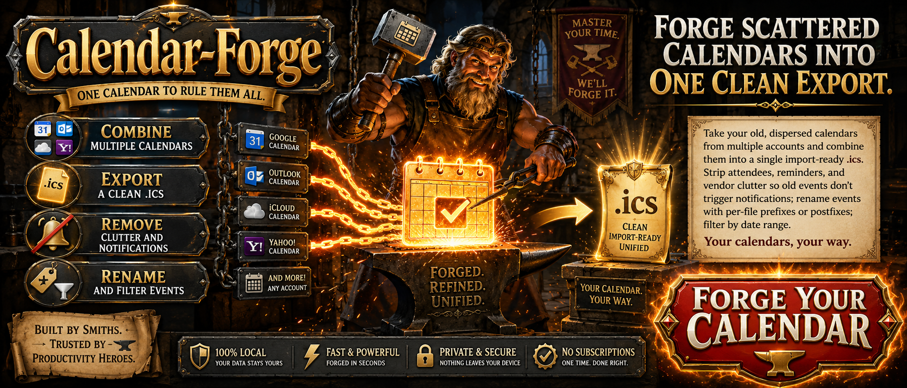

# Calendar Forge



Take your old, dispersed calendars from multiple accounts and combine them into a single import-ready `.ics`. Strip attendees, reminders, and vendor clutter so old events don't trigger notifications; rename events with per-file prefixes or postfixes; filter by date range. Your calendars, your way.

## Requirements

- Python 3.8+
- `tkinter` (included with most Python installs; on Ubuntu: `sudo apt install python3-tk`)

## Run

**Linux / Mac**
```
bash run.sh
```

**Windows**
```
run.bat
```

> **Windows note:** Copy the folder to a local path (e.g. `C:\CalendarForge\`) before running. Windows blocks `.bat` execution directly from network shares (`\\server\...`).

All dependencies are bundled in `lib/` — no pip, no install step, no internet required.

On first launch, `input/` and `output/` folders are created next to the app. Drop your `.ics` files into `input/` — the merged result writes to `output/merged.ics` by default.

## Files

| File | Purpose |
|---|---|
| `ics_processor.py` | Pure ICS logic — no GUI dependency; run directly to self-check |
| `icsscrub.py` | tkinter GUI |
| `run.sh` | Linux/Mac launcher |
| `run.bat` | Windows launcher |
| `requirements.txt` | Python dependencies |

## Features

- Merge multiple `.ics` files into one — first file wins on duplicate events
- Per-file prefix / postfix on event names
- Strip or preserve attendees, with option to append original list to event description
- Strip reminders (VALARM) to prevent old events from firing notifications on import
- Strip vendor X-properties (Apple, Google, Microsoft)
- Exclude cancelled events
- Filter by date range
- Preserves recurring event series and exception instances (RECURRENCE-ID)
- VTIMEZONE deduplication across files
- Handles old Outlook / KOrganizer encoding quirks
- Portable — single folder, no installer
